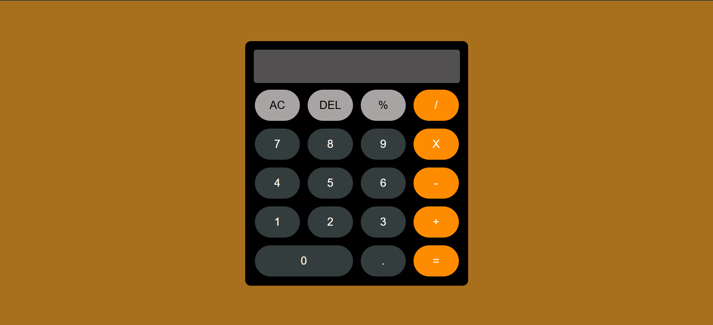

# Calculator

Hi there! 😀
A clean and responsive calculator interface built with HTML and CSS. This project is currently a front-end prototype with a styled layout and all standard calculator buttons. JavaScript functionality (for operations and interactivity) will be added in the future.
🛠️ The JavaScript code is still in progress and will be added once it gets complete.

🌟 Tech Stack 🌟
- HTML
- CSS
- JavaScript (In progress)

🚀 Features

✅ Fully designed calculator layout

✅ Responsive design for different screen sizes

✅ Styled buttons for digits, operations, and control

❌ (Upcoming) JavaScript logic for calculations

Your feedback and suggestions are always welcomed. It will help in improving! 😊

